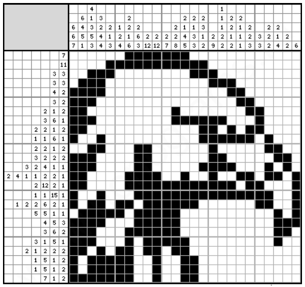
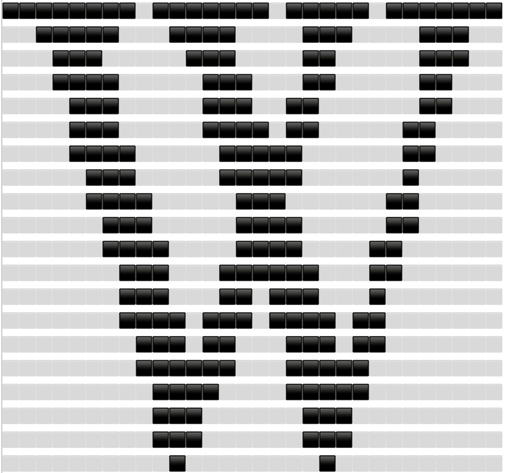

# Nonogram_Puzzle-Prolog

## Introduction
As we know, most of the puzzles can be considered as a search problem. To solve them, we can exhaustively list all possible answers and go back to the list of constraints to test if any one of the answer will satisfy all of the constraints. If the answer produces no contradiction, we know we have the right answer. Since Prolog is a general purpose programming language, it really shines when we have to deal with problems involving exhaustive search. As a result, it is widely used in solving puzzle problems with the complexity class of NP-complete.
My project contains the implementation of nonogram puzzle which is a NP-complete class problem and thus prolog is a suitable choice for implementing it. In what follows, I will describe the project and its implementation in details.

## Nonogram Puzzle
Nonograms are picture logic puzzles in which cells in a grid must be colored or left blank according to numbers at the side of the grid to reveal a hidden pixel art-like picture. In this puzzle type, the numbers are a form of discrete tomography that measures how many unbroken lines of filled-in squares there are in any given row or column. For example, a clue of ”4 8 3” would mean there are sets of four, eight, and three filled squares, in that order, with at least one blank square between successive sets. One example for nonogram puzzle is shown below:


## How to Run the Code
To run the code, we can use SWI-Prolog which is one of the most widely used implementations of Prolog. It's free, open-source, and comes with a comprehensive development environment. To do so, enter the 'execute' command in the query section.
Below is an example of an input sample and the resulted output.
### Example 1:
```prolog
Rows = [[8,7,5,7],[5,4,3,3],[3,3,2,3],[4,3,2,2],[3,3,2,2],[3,4,2,2],[4,5,2],[3,5,1],[4,3,2],[3,4,2],[4,4,2], [3,6,2],[3,2,3,1],[4,3,4,2],[3,2,3,2],[6,5],[4,5],[3,3],[3,3],[1,1]]
Cols = [[1], [1], [2], [4], [7], [9], [2, 8], [1, 8], [8], [1, 9], [2, 7], [3, 4], [6, 4], [8, 5], [1, 11], [1, 7], [8], [1, 4, 8], [6, 8], [4, 7]
, [2, 4], [1, 4], [5], [1, 4], [1, 5], [7], [5], [3], [1], [1]]
```

